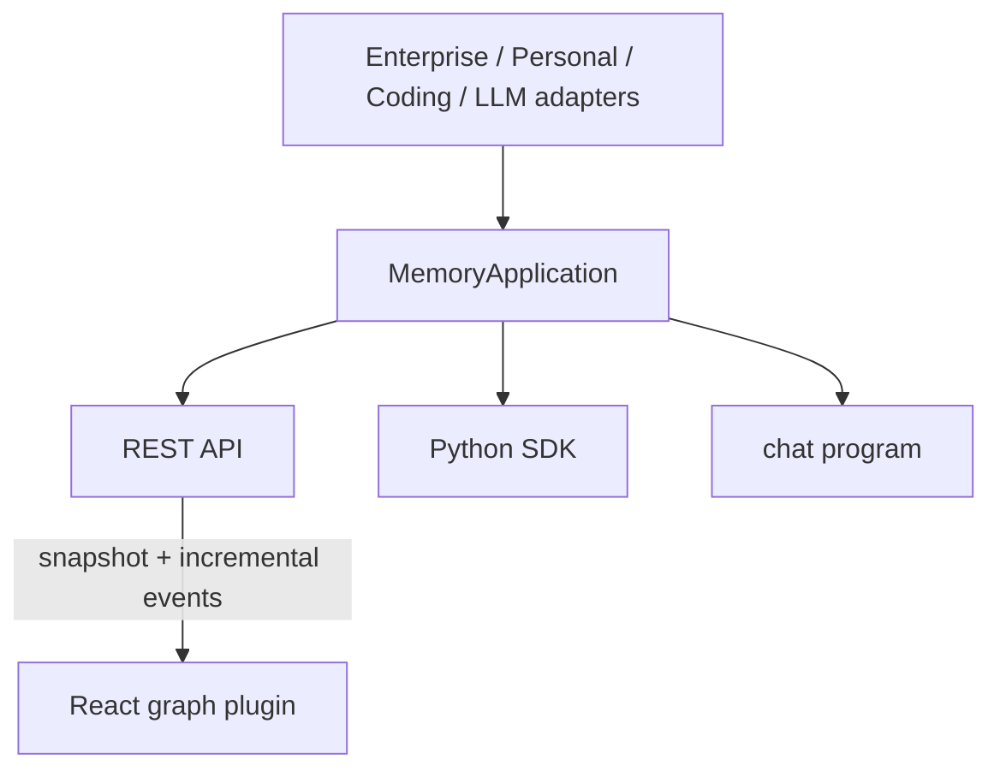

# Visualization, API, SDK, and Integration

HAMGF exposes the same `MemoryApplication` runtime through a REST API, a small Python SDK, and a React/Cytoscape graph plugin. Dataset and model adapters feed that runtime without embedding external schemas into the core graph.

## Runtime boundary



`MemoryApplication` owns the graph, pools, lifecycle writer, lock, revision, incremental events, and configured persistence.

## REST surface

The service provides:

| Endpoint | Purpose |
|---|---|
| `GET /health` | public liveness and current revision |
| `GET /v1/graph` | full graph view |
| `GET /v1/snapshot` | NetworkX node-link graph snapshot |
| `GET /v1/events?since=` | incremental UI events |
| `GET /v1/nodes/{node_id}` | node details and credibility timeline |
| `GET /v1/audit` | decision and supersession history |
| `POST /v1/memories` | lifecycle-aware memory write |
| `POST /v1/search` | chain search |
| `PATCH /v1/edges` | human-reviewed edge correction |

All `/v1/*` routes can be protected with a Bearer token; `/health` remains public. CORS origins are configurable. Loopback binding is the safe development default. Production TLS, identity, authorization, rate limiting, and retention remain deployment responsibilities. See [REST API and Python SDK](api.md).

The default frontend client/plugin does not expose a Bearer-token prop.

## Python SDK

`HamgfClient` is a thin standard-library HTTP client and mirrors the REST operations:

```python
from hamgf import HamgfClient

client = HamgfClient("http://127.0.0.1:8000", api_token="optional-token")
client.write_memory(
    "The customer approved proposal B.",
    importance=0.9,
    timeliness=0.9,
)
chain = client.search("Which proposal was approved?", k=5)
print(chain["node_ids"])
```

## React graph plugin

The front-end renders a horizontal memory-chain canvas with:

- causal, temporal, and semantic edge styles;
- branch expansion/collapse and merge visibility;
- active, pending, superseded, and archived node states;
- node detail and credibility history;
- interactive backward/forward trace highlighting;
- correction-chain comparison; and
- snapshot plus incremental-event polling.

The interface deliberately uses a restrained black/gray/white palette and a small number of surfaces. Corrections go through the API so schema validation and change recording remain intact.

Development startup:

```bash
PYTHONPATH=src python -m hamgf.api --demo
cd frontend
npm ci
npm run dev
```


## Inference chat

The terminal chat program starts the API and graph page, retrieves memory before each model call, and writes successful turns back to the graph:

```bash
HAMGF_LLM_BASE_URL=http://127.0.0.1:11434/v1 \
HAMGF_LLM_MODEL='<model-name>' \
hamgf-chat
```

The backend is OpenAI-compatible but provider-specific parameters still belong in adapter/configuration code.

## Enterprise adapter

`EnterpriseChatParser` probes each de-identified export before parsing. It detects timestamp/speaker patterns, message boundaries, media placeholders, and entity shapes. Low-confidence formats fail closed unless a human explicitly overrides them. `EnterpriseMemoryAdapter` sends accepted events through the same classifier, credibility, pool, graph, and relation path used elsewhere.

The current authorized case validation covers 15 de-identified conversations: 15/15 passed the implemented structural pipeline, producing 980 accepted events, 867 CMG nodes, and 852 logical edges.

## Personal and Coding adapters

`LocalModelMemoryAdapter` ingests local conversation turns. The included Coding adapter accepts minimized public/authorized commit and issue records and retains source timestamps for timeline inspection. Validation covers a recorded public NetworkX sample with 20 commits and 20 non-PR issues plus a local synthetic secret-recall scenario. This demonstrates functional integration, explicit chain references, and encrypted round-trip behavior. See [Personal and Coding integration](personal-integration.md).

## Persistence and deployment

The runtime can use JSON snapshots, optional AES-256-GCM encrypted snapshots, or Neo4j full-state synchronization. Docker Compose configuration connects the API, Neo4j, and static front end. Verify the Compose topology on the deployment host; configuration checks do not prove that containers ran successfully. See [Deployment and operations](deployment.md).

## Verification

```bash
python -m tests
```

Python tests, front-end tests, and the production build export their reports to `tests/sol/`. Comparative and stress results are summarized in [Evaluation and validation](evaluation-and-validation.md).
